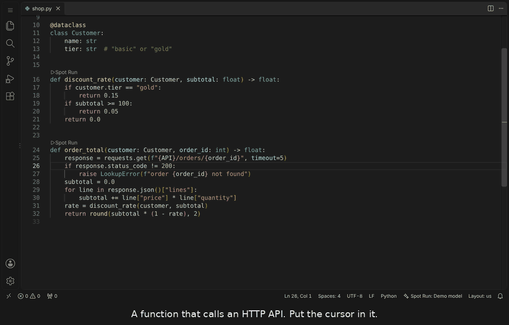
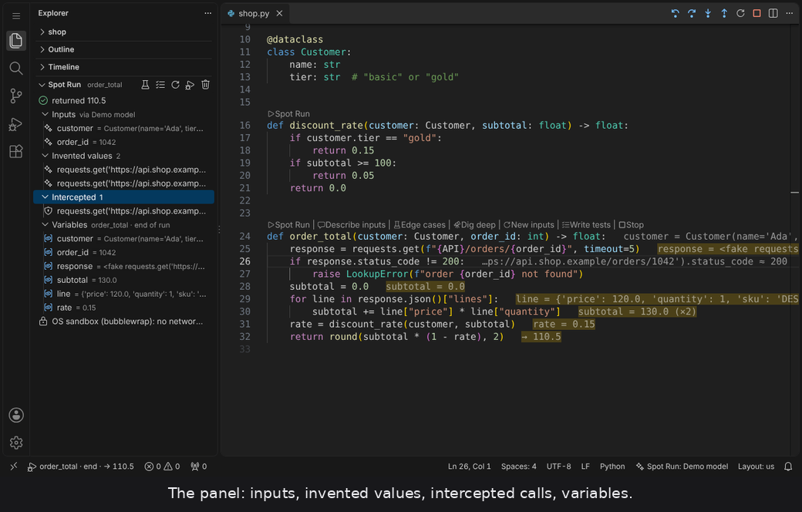
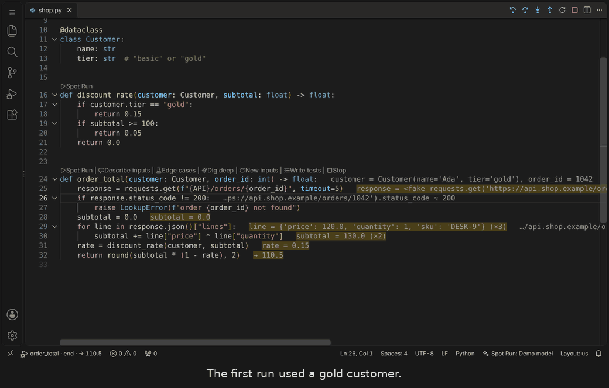
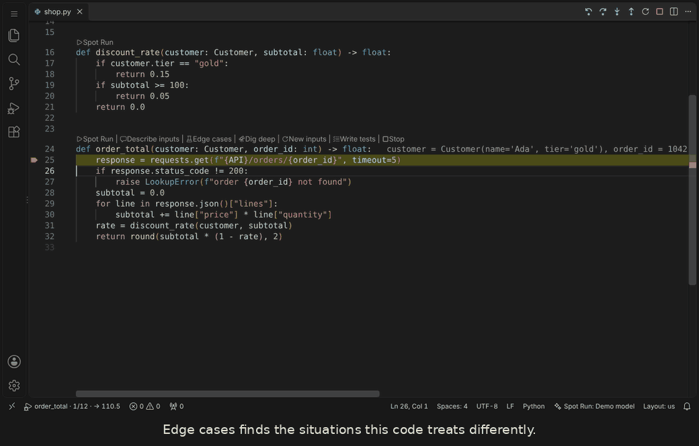
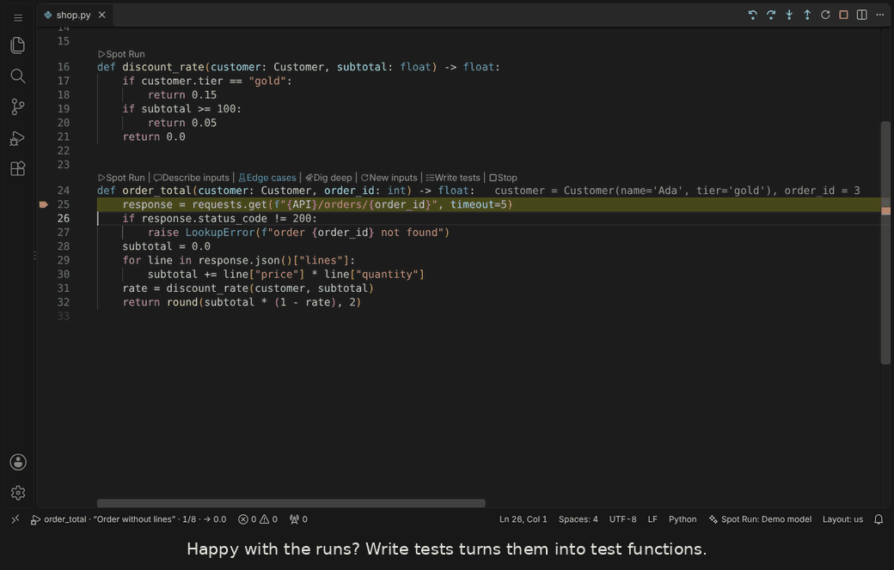

# Spot Run

Run any Python function on the spot and step through it. No test to write, no launch configuration, no harness.

Put the cursor in a function and press `Ctrl+Alt+Enter` (`Cmd+Alt+Enter` on macOS). A language model invents the inputs, everything the function would do to the outside world is replaced by fakes, and the recorded run is shown in the editor the way the debugger shows one.



The demos on this page were recorded in VS Code with a scripted demo model, so they are reproducible. With GitHub Copilot the values differ, the behaviour is the same.

## Contents

- [Quick start](#quick-start)
- [What you can do](#what-you-can-do)
- [How it works](#how-it-works)
- [Safety](#safety)
- [Check your setup](#check-your-setup)
- [When importing the file fails](#when-importing-the-file-fails)
- [Limits you should know](#limits-you-should-know)
- [Settings](#settings)
- [Development](#development)

## Quick start

1. Install the extension and open a Python file.
2. Put the cursor inside a function and press `Ctrl+Alt+Enter`, or click **Spot Run** above the `def`.
3. The first run asks for permission to use GitHub Copilot's models. Without a model the extension still works, with plain sample values.
4. Step with the usual debugger keys.

| Key | Action |
| --- | --- |
| `Ctrl+Alt+Enter` | Run the function at the cursor |
| `F10` | Step over |
| `F11` | Step into (functions in your workspace are recorded too) |
| `Shift+F11` | Step out |
| `Shift+F10` | Step back |
| `Ctrl+Alt+Shift+Enter` | Describe the inputs in your own words, then run |
| `Ctrl+Alt+]` / `Ctrl+Alt+[` | Next / previous edge case |
| `Esc` | Leave the replay |

The stepping keys are bound only while a replay is showing and no debug session is active. On macOS use `Cmd` where the table says `Ctrl+Alt`.

After the first run, the actions above the function are:

**Spot Run** · **Describe inputs** · **Edge cases** · **Dig deep** · **New inputs** · **Write tests** · **Stop**

The walkthrough **Get started with Spot Run** (Command Palette: *Welcome: Open Walkthrough*) shows the same steps inside the editor.

## What you can do

### Step through a recorded run

Stepping is a replay of a recording, so it is instant and works backwards. Values appear next to the line that produced them, hovering a variable shows its value at the current step, and the status bar shows where you are and how the run ended. A function that raises opens on the failing line.

Editing the file ends the replay, since the recording no longer matches the text. Save the file and the same function runs again with the same inputs.

### See what was invented and what was intercepted

The **Spot Run** section in the Explorer sidebar (click the status bar entry to reveal it) lists the inputs, every value that was invented for a fake, every real call that was intercepted, the variables at the current step, the call stack and the output. Inputs and invented values have an edit action: enter a Python expression to pin a value. Pins are never overwritten by the model.



### Describe the inputs

Click **Describe inputs**. A small conversation opens under the `def` line. Say what the data should look like, for example "a basic customer with one expensive item" or "the API answers 404", and the function runs with inputs built to that description. Follow-ups refine the previous inputs. The description steers the fake values as well as the arguments.



### Edge cases

Click **Edge cases**. The model reads the function and proposes the cases this code treats differently: the typical one, then empty inputs, boundary values, error paths and failing dependencies, ten at most by default. Each case has a short title and is run once, so the list shows for every case whether it returned or raised. Pick one to step through it. `Ctrl+Alt+]` and `Ctrl+Alt+[` move between cases, and the panel lists them for one-click switching.



### Write tests

When the runs look right, click **Write tests**. Each run you select becomes one test that reproduces it: the same arguments, mocks for the calls Spot Run intercepted, and an assertion on the result or exception you saw.

The model decides where the tests belong. It is shown the existing test files, the test configuration, the file that already tests this module if there is one, and another test file as a style example. It appends to the existing file or creates one that follows the project's pattern. Nothing existing is overwritten.

The new tests are then run once with `pytest` under a guard that refuses real network, process and file effects. If they fail, the model gets the output and one chance to correct them. The notification says how many pass.



### Dig deep

For functions whose signature says little about the data, click **Dig deep**. The model may then look through your workspace before it proposes inputs: search, read parts of files, fetch a definition, list call sites, eight lookups at most by default. It answers with arguments, the imports they need for types from other modules, and a note on the data shapes it found. The panel lists every lookup.

This is opt-in because it costs more requests and sends parts of the files it reads to the model. Dependencies, hidden folders, large files and anything whose name looks like a secret are never read.

### Choose the model

While a Python file is open, the status bar shows the model in use. Click it to pick from the models VS Code offers (GitHub Copilot's and any other registered provider's), or choose Automatic or None. Automatic takes the smallest fast model available.

### Open a run in the real debugger

**Spot Run: Open This Run in the Debugger** starts a `debugpy` session on the same function with the same inputs and cached fake values, stopped at the first line.

## How it works

**Inputs.** The model receives the file (or, for large files, its imports, the classes the signature refers to and the function), the parameter list, and up to three existing calls found in test files. It answers with one Python expression per parameter, evaluated inside the module's namespace so it can build your own classes. Answers are remembered per function until the signature changes, so a second run makes no model request.

**Lazy fakes.** A fake accepts any attribute access, item access or call and returns another fake that remembers the expression that produced it, for example `requests.get('https://shop.test/items').json()['items']`. A value is only needed when your code uses a fake as one: iterating it, testing its truth, comparing it, doing arithmetic, formatting it. At that moment the model is asked a narrow question with the expression, the kind of use, the current line and the function source. Results that are never used cost nothing.

**Recording.** The function runs in a subprocess with a tracer that stores, for every executed line, what that line changed. The editor rebuilds the state at any step from those changes.

## Safety

Spot Run executes your real code. Two layers keep it from touching anything real.

**The guard**, inside the Python process:

- A fixed table of effectful libraries is replaced by fakes before your module is imported: `requests`, `httpx`, `urllib`, `aiohttp`, `subprocess`, `os.system`, `smtplib`, `ftplib`, `sqlite3` (files only), `psycopg`, `pymysql`, `pyodbc`, `asyncpg`, SQLAlchemy sessions and engines, `pandas.read_sql`, `pymongo`, `redis`, `boto3`, Google Cloud and Azure storage clients, `openai`, `anthropic`, `paramiko`, `kafka`, `pika`, `elasticsearch`, `docker`, `input()`. `time.sleep` is skipped.
- File writes go to memory; deletes, renames, copies and `mkdir` are recorded and skipped. The function sees a consistent view of that, so a file it wrote can be read back.
- An audit hook refuses any remaining socket, child process or file change. It raises `EffectBlocked`, which derives from `BaseException` so that `except Exception` does not swallow it. If the effect came from a library call, that call is faked and the run repeated.

**The operating-system sandbox**, around the Python process:

- On Linux (with `bubblewrap` installed) and macOS (`sandbox-exec`), the subprocess runs with no network at all and a read-only filesystem except for one scratch folder. This is enforced by the kernel, so it also covers what the guard cannot see: C extensions doing their own I/O, code that runs while the module is imported, child processes.
- The sandbox is tried once per interpreter. If it does not work on the machine, runs fall back to the guard alone and the panel says so. Set `spotrun.sandbox` to `required` to refuse to run without it.
- Windows has no supported sandbox. There the guard is the only layer.

The last line of the panel shows which layer was active for the run.

What neither layer changes: every run sends the function's file to the model provider, and Dig deep sends parts of other files. Generated expressions are model output executed in your interpreter. Fakes return plausible data, not true data, so a clean run shows how your logic behaves on reasonable inputs and nothing more.

## Check your setup

Run **Spot Run: Self-Check** from the Command Palette. It verifies, on your machine and with your model:

1. the Python interpreter is found and recent enough,
2. the runtime runs and records a bundled sample function,
3. the guard refuses a real network connection,
4. whether the operating-system sandbox is active,
5. the language model answers,
6. inputs generated by the model run.

The result is a one-line summary; the details are in the **Spot Run** output channel. Include that output when reporting a problem.

## When importing the file fails

The function is imported from its file before it can run, so anything that goes wrong at module level stops the run with "Importing x.py failed: ..." and the reason on the same line. The usual causes:

- **An installed package is not found.** Spot Run is using a different interpreter than your project. Select the interpreter in the Python extension or set `spotrun.pythonPath`. The message names the interpreter that was used.
- **One of your own modules is not found.** A module anywhere inside the workspace folder is located and its folder added to the import path automatically. For code outside the workspace, list the folder in `spotrun.extraPaths`. `python.analysis.extraPaths` and `PYTHONPATH` from the workspace `.env` file are used as well.
- **The file does real work on import**, such as reading a config file, parsing command-line arguments or connecting to something. That code has to succeed first. A missing required environment variable is given an invented value.
- **A circular import** that only works when the file is reached through another module.

Handled automatically: regular packages, packages without `__init__.py` that use relative imports, a `src/` folder, and source roots below the workspace folder.

## Limits you should know

- Fakes return plausible data, not true data. Spot Run does not tell you whether a query is correct against the real schema.
- `x is None` on a fake is always false, and `isinstance` only works for fakes created from an annotated parameter or a patched class.
- Tests written from runs assert what was observed. If the function has a bug and you approved the run, the test keeps the bug.
- Long loops are recorded for the first 200 passes of each line, 20,000 steps in total. The function still runs to the end.
- Model requests count against your Copilot quota. A first run typically makes one request for the arguments and one per fake value actually used. Dig deep and edge cases make more.
- The conversation for describing inputs uses VS Code's comment threads, so the extension sets the default of `comments.openView` to `never` to keep the Comments panel from opening on its own. Set it back if you rely on that panel for pull request reviews.
- Verified on Linux. The macOS sandbox profile and Windows behaviour have not been run on those systems; use the self-check there first.

## Settings

| Setting | Default | |
| --- | --- | --- |
| `spotrun.useLanguageModel` | `true` | Use a model for inputs and fake values |
| `spotrun.model` | `""` | Model family, id or name. Empty picks the smallest fast model, Copilot first. Set it from the status bar |
| `spotrun.sandbox` | `auto` | `auto`, `required` or `off`: operating-system containment |
| `spotrun.rerunOnSave` | `true` | After an edit, saving runs the same function again |
| `spotrun.pythonPath` | `""` | Interpreter. Empty uses the Python extension's selection |
| `spotrun.extraPaths` | `[]` | Extra import folders, for your own code outside the workspace |
| `spotrun.scope` | `workspace` | What is recorded for stepping into: `workspace`, `file` or `function` |
| `spotrun.startAt` | `first` | Start the replay on the first line or at the end |
| `spotrun.timeoutSeconds` | `20` | Model wait time excluded |
| `spotrun.maxModelCalls` | `30` | Per run, for fake values |
| `spotrun.edgeCases.max` | `10` | Most edge cases proposed per function |
| `spotrun.digDeep.always` | `false` | Read the workspace every time inputs are generated |
| `spotrun.digDeep.maxLookups` | `8` | Searches and file reads per Dig deep, one model request each |
| `spotrun.codeLens` | `true` | Show the actions above functions |
| `spotrun.saveBeforeRun` | `true` | The function is imported from disk |

## Requirements

VS Code 1.95 or later and Python 3.9 or later. GitHub Copilot, or another provider registered with the VS Code Language Model API, for generated values. Optional: the Python extension (supplies the selected interpreter), the Python Debugger extension (for the debugger hand-off), `pytest` (to check written tests), `bubblewrap` on Linux (for the sandbox).

## Development

```
npm install
npm run build          # bundle to dist/
npm test               # type check, unit tests, runtime tests
npm run package        # build the .vsix
```

Layout:

- `python/spotrun_runtime/` is the runtime, standard library only. `fakes.py` has the lazy fake, `guard.py` the patch table and audit hook, `tracer.py` the recorder, `runner.py` the orchestration and the JSON-lines protocol with the extension.
- `src/core/` is editor-independent TypeScript: the function parser, the replay model, the prompts, the process bridge, the sandbox, the lookup loop for Dig deep and the test writer. It is covered by `test/core.test.ts`, which also drives the real runtime.
- `src/*.ts` is the VS Code layer: commands, decorations, the panel, the Language Model API bridge.
- `tests/` holds the pytest suite for the runtime and its sample modules.

End-to-end checks and the demos run in a real workbench (code-server) driven by Playwright. `e2e/fake-lm` is a test-only language model provider with scripted answers.

```
CODE_SERVER=.../code-server/out/node/entry.js \
PLAYWRIGHT=.../node_modules/playwright-core \
CHROMIUM=.../chrome \
npm run test:e2e            # add -- --no-model for the fallback path
npm run demo                # record the frames, then build docs/media
node e2e/docs-check.mjs     # the walkthrough opens and its pictures are packaged
```

The pictures in this README are relative links in the repository. When the extension is packaged they are rewritten to this repository's address on GitHub, because VS Code's extension page and the Marketplace only load pictures over HTTPS. They therefore show there once the repository is public. The walkthrough ships its pictures inside the package and works regardless.
